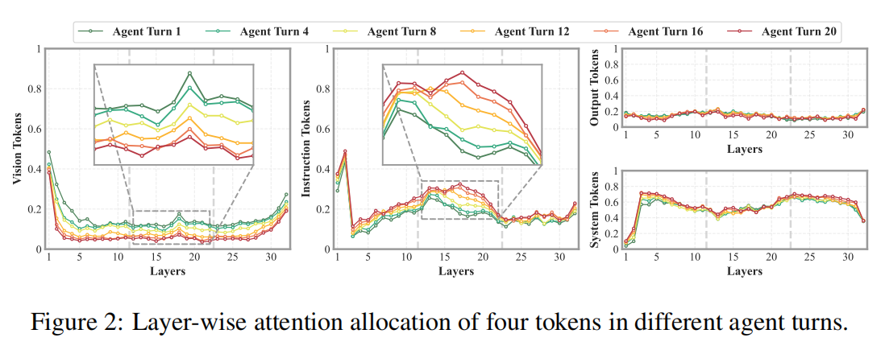
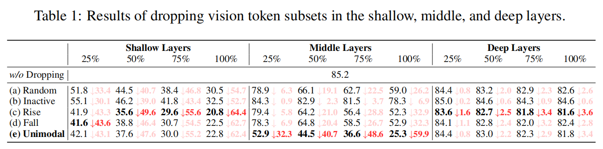
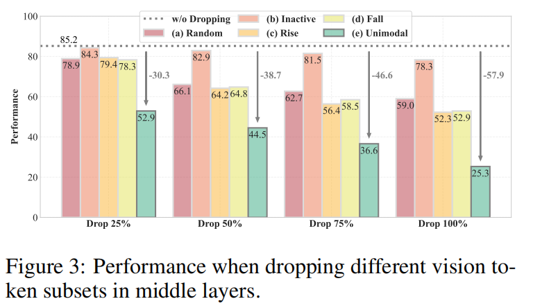
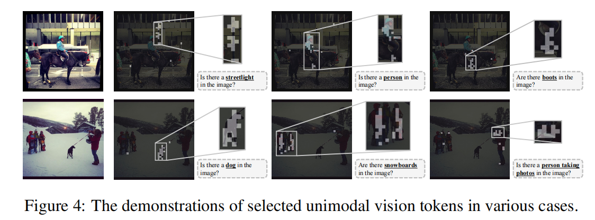
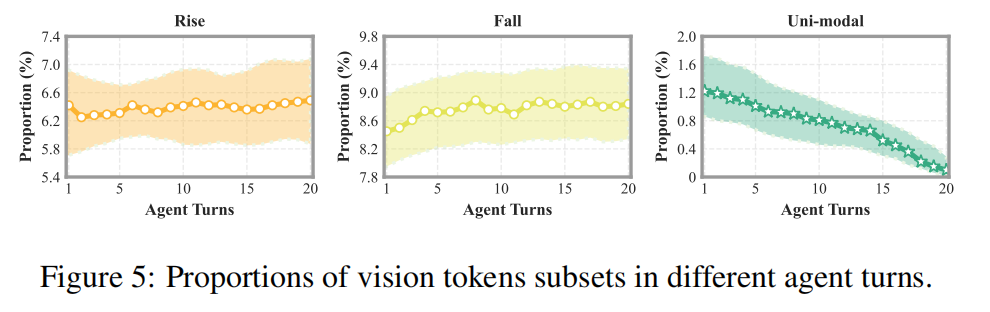

# Visual Multi-Agent System: Mitigating Hallucination Snowballing via Visual Flow


## 🌟Quick Start

### 1) Install
```bash
conda create -n vif python=3.10 -y
conda activate vif
pip install -r requirements.txt
```

### 2) Prepare
- Place the base VLM (e.g., LLaVA-NeXT) under `./examples/base_model/` or pass a HuggingFace model id.
- Prepare multimodal data:
  - Stage 1: general pretraining/tuning data (image, instruction, short answer) – paths in `configs/stage1.yaml`
  - Stage 2: instruction-tuning datasets – paths in `configs/stage2.yaml`
- Multi-Agent Construction
  - Files under `vif/multiagent/` implement the **meta-agent** and ** worker agents** with dynamic allocation.


### 3) Train
```bash
# Stage 1 Pre-Training
python scripts/train_stage1.py --config configs/stage1.yaml

# Stage 2 Instruction Tuning
python scripts/train_stage2.py --config configs/stage2.yaml
```

### 4) Evaluate
```bash
python scripts/eval_demo.py --config configs/eval.yaml --images_dir examples/data/images --questions_file examples/data/train_stage2.jsonl
```


## 🌟Requisite Analyses
### Layer-Wise Attention Allocation in Different Agent Turns
<div style="text-align: center;">
  
</div>

### Dropping Subsets of Vision Tokens in Different Layers
<div style="text-align: center;">
  
</div>
<div style="text-align: center;">
  
</div>

### Investigation of Unimodal Tokens
<div style="text-align: center;">
  
</div>
<div style="text-align: center;">
  
</div>

### Insights
- The visual evidence relayed in MAS, which is typically via textual flow, potentially results in multi-agent hallucination snowballing. 
- When the agent turns increase, the average attention allocated to vision tokens reduces, and the attention peak in middle layers diminishes, while attention to instruction tokens increases accordingly; system and output tokens receive relatively stable attention. 
- In middle layers, vision tokens with unimodal attention allocation relay visual information; all vision tokens are significant in shallow layers and less significant in deep layers.

## 🌟Overview

<div style="text-align: center;">
  
</div>