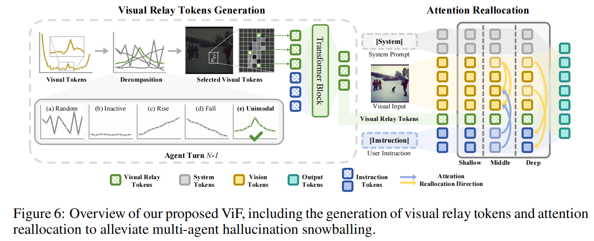

# Visual Multi-Agent System: Mitigating Hallucination Snowballing via Visual Flow

## The implementation source code will be made publicly available after acceptance.

## 🌟Requisite Analyses
### Layer-Wise Attention Allocation in Different Agent Turns

  

### Dropping Subsets of Vision Tokens in Different Layers

  

  

### Investigation of Unimodal Tokens

  

  

## 🌟Overview

  

